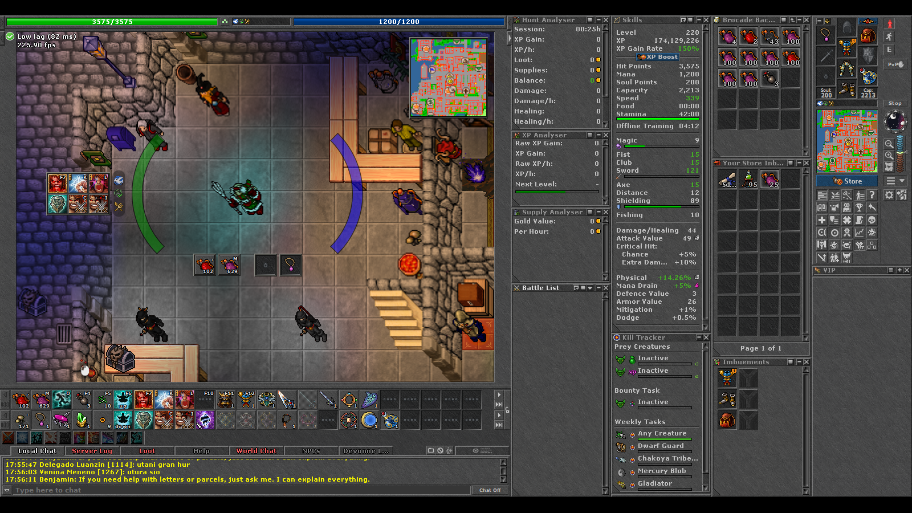
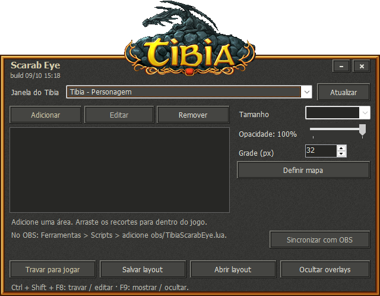

# Tibia Scarab Eye

Traga para perto do centro da tela as partes do cliente do Tibia que você mais
precisa olhar, e leve exatamente o mesmo resultado para a sua live ou gravação
no OBS.

O Tibia Scarab Eye recorta áreas do cliente (minimapa, ícones de ação, barras,
slots de itens e qualquer outra região) e as exibe como pequenas janelas por
cima da área de jogo, com a borda no estilo do próprio Tibia. Com a
sincronização ligada, as mesmas overlays aparecem dentro do OBS, no mesmo lugar
e no mesmo tamanho.



*Cena do OBS: o minimapa, os ícones de ação e os slots de itens aparecem como
overlays sobre o mapa, enquanto o cliente continua inalterado.*

## O que ele faz

- **Cria overlays a partir de qualquer região do cliente.** Selecione a área
  com um retângulo livre ou um quadrado, com zoom, deslocamento e medidas
  exatas em pixels. Por padrão a seleção se encaixa em blocos de slots do Tibia
  (34, 70, 106 px…), do slot da action bar até a largura do minimapa.
- **Posiciona as overlays antes de elas aparecerem.** O planejador mostra o
  jogo ao vivo dentro do programa. Arraste
  cada área até o lugar certo; ela se encaixa na grade e só aparece na tela
  quando você trava para jogar.
- **Ajusta cada overlay.** Edite a seleção depois, sem precisar remover a
  área, e mude o tamanho do recorte.
- **Controla a opacidade** de cada overlay (de 20% a 100%).
- **Trava para jogar.** Em modo jogo, as overlays aparecem sobre o jogo e
  deixam o mouse passar para o cliente. Em modo edição elas ficam escondidas e
  você as reposiciona no planejador.
- **Atalhos globais** que funcionam mesmo com o painel minimizado:
  `Ctrl + Shift + F8` alterna edição e jogo, `Ctrl + Shift + F9` mostra ou
  oculta as overlays na tela e no OBS.
- **Encaixe preciso.** Ao arrastar, as áreas se prendem a uma grade invisível
  de 8 px sobre a janela do jogo; a grade não é desenhada.
- **Salva e abre layouts** em arquivos JSON.
- **Sincroniza com o OBS.** As overlays aparecem na cena, acima da captura do
  jogo, e acompanham o que você muda no programa em cerca de 100 ms.



## Como funciona

1. O programa mostra cada recorte com miniaturas do DWM (o compositor do
   Windows) sobre a janela do Tibia. Não há leitura de memória, injeção nem
   alteração do cliente.
2. Para o OBS, o programa publica **somente a geometria** (posição, tamanho,
   recorte e opacidade) em `%LOCALAPPDATA%\TibiaScarabEye\obs-layout.json`.
3. O script `obs/TibiaScarabEye.lua` lê esse arquivo e a transformação real da
   sua **Captura de jogo**, e desenha cada overlay como um grupo na cena,
   reaproveitando a imagem que o OBS já captura. Nada é recapturado da tela.

Por isso, se a Captura de jogo estiver preta ou sem sinal, as overlays também
ficam sem imagem: o Tibia Scarab Eye não contorna bloqueios de captura.

## Requisitos

- Windows 10 ou 11, x64
- [.NET 8 Desktop Runtime](https://dotnet.microsoft.com/download/dotnet/8.0)
  (x64). Para compilar, o .NET 8 SDK
- OBS Studio (testado na versão 32.2.2) com uma fonte **Captura de jogo**
  mostrando o Tibia, direto na cena (fora de grupos)

## Começando

### Compilar

```powershell
dotnet build TibiaScarabEye.sln -c Release
```

O executável sai em `artifacts\bin\TibiaScarabEye\release\TibiaScarabEye.exe`.
Para gerar uma pasta pronta para distribuir:

```powershell
dotnet publish src\TibiaScarabEye -c Release -r win-x64 --self-contained false
```

### Testes

```powershell
dotnet test TibiaScarabEye.sln
```

Os testes da categoria `Desktop` abrem janelas reais fora da área visível e
usam o DWM do Windows, então precisam de uma sessão de desktop. Para rodar só
os testes que não dependem dela: `dotnet test --filter "Category!=Desktop"`.

### Usar no OBS

1. Abra `TibiaScarabEye.exe`, escolha a janela do Tibia em **Janela do Tibia**
   e crie suas áreas com **Adicionar**. Depois de cada área, o planejador abre
   para você posicioná-la; use **Posicionar áreas** para voltar a ele.
2. No OBS, vá em **Ferramentas > Scripts**, clique em `+` e escolha
   `obs/TibiaScarabEye.lua`.
3. No programa, clique em **Sincronizar com OBS**. Os grupos
   `Tibia Scarab Eye xxxxxx` aparecem no topo da cena.
4. Clique em **Travar para jogar** e jogue.

No **modo manual** (padrão do script), cada overlay aparece na primeira vez
onde o programa a colocou. Depois você pode arrastá-la e redimensioná-la no
preview do OBS, e a posição fica salva. Desmarque esse modo para que a posição
venha sempre do programa. O guia completo, com diagnóstico e ajuste fino, está
em [`docs/LEIA-ME.txt`](docs/LEIA-ME.txt).

## Estrutura do projeto

| Caminho | Conteúdo |
|---|---|
| `TibiaScarabEye.sln` | Solução com o aplicativo e os testes |
| `src/TibiaScarabEye/` | Aplicativo (WinForms, .NET 8, x64) |
| `src/TibiaScarabEye/Interop/` | P/Invoke e DWM. `Native.ThumbnailBounds` é a origem correta das coordenadas da miniatura |
| `src/TibiaScarabEye/Layouts/` | `RegionSpec` e `Layout`: modelo e arquivo JSON dos layouts |
| `src/TibiaScarabEye/Obs/` | `ObsBridge` publica o layout para o OBS a cada 100 ms |
| `src/TibiaScarabEye/UI/` | Janela principal, seletor de área, planejador de posições, overlays e tema |
| `tests/TibiaScarabEye.Tests/` | Testes xUnit (unitários e de desktop) |
| `obs/TibiaScarabEye.lua` | Script do OBS: cria as overlays como grupos na cena |
| `docs/LEIA-ME.txt` | Instruções de uso e instalação no OBS |
| `Directory.Build.props`, `Directory.Packages.props`, `global.json` | Propriedades comuns, versões de pacotes e versão do SDK |

## Notas técnicas

- O programa declara DPI do sistema (`ApplicationHighDpiMode=SystemAware` no
  `.csproj`).
- As coordenadas da miniatura DWM começam em `GetWindowRect` (que inclui a
  borda invisível de 7 a 8 px), e o tamanho é o do quadro estendido. O código
  usa `Native.ThumbnailBounds` para isso. Usar `DwmGetWindowAttribute` como
  origem desloca as overlays no OBS.
- O título da janela mostra a data e a hora da compilação (`build dd/MM HH:mm`).
  Antes de diagnosticar um deslocamento, confira se ela é a do executável que
  você acabou de compilar.

## Limitações

- A Captura de jogo precisa estar diretamente na cena. Se estiver dentro de um
  grupo, nenhuma overlay é criada naquela cena, e o script registra um aviso no
  log do OBS (Ajuda > Arquivos de log, linha `Tibia Scarab Eye: AVISO`).
- Jogo em tela cheia exclusiva não foi testado. O programa depende das
  miniaturas do DWM, então o recomendado é o Tibia em janela ou maximizado.
- Com monitores de escalas diferentes, o alinhamento não foi verificado.
- O script do OBS foi validado no OBS 32.2.2 com fonte de imagem. Com o
  Tibia real ainda não foi exercitado nesta base.

## Licença

Todos os direitos do programa pertencem a [augustcaio](https://github.com/augustcaio). O repositório é público apenas para consulta. Veja [LICENSE](LICENSE).
